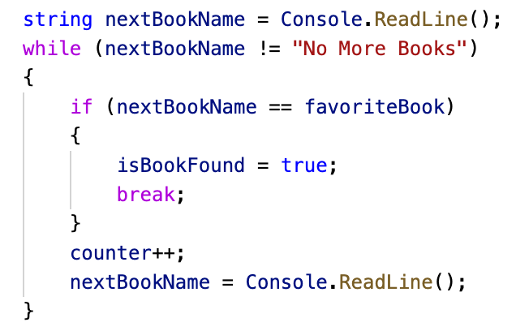
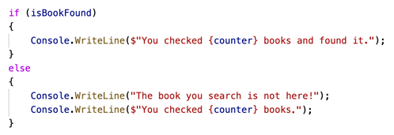
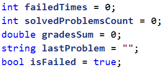
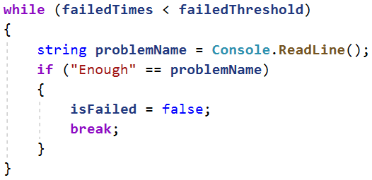
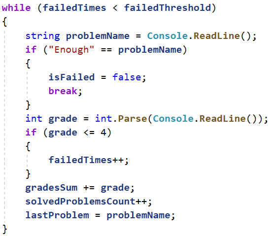

**Упражнение: Повторения с цикли – While-цикъл**

Задачи за упражнение и домашно към курса ["Основи на програмирането" в
СофтУни](https://softuni.bg/courses/programming-basics).

**Тествайте** решението си в **judge системата**:
<https://judge.softuni.bg/Contests/2384>

## Старата Библиотека

Ани отива до родния си град след много дълъг период извън страната. Прибирайки
се вкъщи тя вижда старата библиотека на баба си и си спомня за любимата си
книга. Помогнете на Ани, като напишете програма в която тя въвежда търсената от
нея **книга**(**текст**). **Докато Ани не намери любимата си книга или не
провери всички в библиотеката, програмата трябва да чете всеки път на нов ред
името на всяка следваща книга (текст). Книгите в библиотеката са свършили щом
получите текст "No More Books".**

-   **Ако не открие търсената книгата да се отпечата на два реда:**

-   **"The book you search is not here!"**

-   **"You checked {брой} books."**

-   **Ако открие книгата си се отпечатва един ред:**

    -   **"You checked {брой} books and found it."**

### Примерен вход и изход

| **Вход**                                                                                                  | **Изход**                                             | **Обяснения**                                                                                                                                                                                                                                                   |
|-----------------------------------------------------------------------------------------------------------|-------------------------------------------------------|-----------------------------------------------------------------------------------------------------------------------------------------------------------------------------------------------------------------------------------------------------------------|
| Troy Stronger Life Style Troy                                                                             | You checked 2 books and found it.                     | Книгата която Ани търси, в случая е Troy. Първата книга от библиотеката е Stronger, втората е Life Style, третата книга е търсената – Troy и програмата приключва.                                                                                              |
| The Spot Hunger Games Harry Potter Torronto Spotify No More Books                                         | The book you search is not here! You checked 4 books. | Книгата, която търси Ани е "The Spot". Първата книга от библиотеката е Hunger Games, втората Harry Potter, третата Torronto, а четвъртата Spotify. Понеже няма повече книги в библиотеката, четенето на имена приключва. Ани не намери книгата, която търсеше.  |
| Bourne True Story Forever More Space The Girl Spaceship Strongest Profit Tripple Stella The Matrix Bourne | You checked 10 books and found it.                    |                                                                                                                                                                                                                                                                 |

### Насоки

1.  Прочетете входните данни от конзолата.

1.  Направете **още две помощни променливи в началото**, които да следят **дали
    книгата е намерена или всички книги са проверени**. Едната променлива ще е
    **брояч** и трябва да е **от тип цяло число** и с **първоначална стойност
    нула**. С нея ще следим **колко книги са проверени**. Другата променлива
    трябва да е от **булев тип** и да е **с началната стойност false**.

1.  Направете си **while** цикъл, в който **всеки път** ще четете от конзолата
    нова книга, докато книгите в библиотеката **се изчерпят и прочетете текста
    "No More Books".**

1.  Ако книгата, която четете от конзолата **съвпада с любимата книга на Ани**,
    презапишете стойността на **променливата от булев тип**, и **прекратете
    цикъла**, в противен случай **увеличете брояча с едно**.

1.  Според това, дали книгата е намерена, **принтирайте нужните съобщения**.

## Подготовка за изпит

Напишете програма, в която Марин решава задачи от изпити **докато не получи**
съобщение **"Enough"** от лектора си. При всяка решена задача той получава
оценка. **Програмата трябва да приключи прочитането на данни при команда
"Enough" или ако Марин получи определения брой незадоволителни оценки.**  
**Незадоволителна е всяка оценка, която е по-малка или равна на 4.**

### Вход

-   **На първи ред - брой незадоволителни оценки - цяло число в интервала
    [1…5]**

-   **След това многократно се четат по два реда:**

    -   **Име на задача - текст (низ)**

-   **Оценка - цяло число в интервала [2…6]**

### Изход

-   Ако Марин стигне до командата **"Enough", отпечатайте на 3 реда:**

-   **"Average score: {средна оценка}"**

-   **"Number of problems: {броя на всички задачи}"**

    -   **"Last problem: {името на последната задача}"**

-   **Ако получи определеният брой незадоволителни оценки:**

-   **"You need a break, {брой незадоволителни оценки} poor grades."**

**Средната оценка да бъде форматирана до втория знак след десетичната запетая.**

### Примерен вход и изход

| **Вход**                                     | **Изход**                                                   | **Обяснения**                                                                                                                                                                                                                                                                                                                                                                       |
|----------------------------------------------|-------------------------------------------------------------|-------------------------------------------------------------------------------------------------------------------------------------------------------------------------------------------------------------------------------------------------------------------------------------------------------------------------------------------------------------------------------------|
| 3 Money 6 Story 4 Spring Time 5 Bus 6 Enough | Average score: 5.25 Number of problems: 4 Last problem: Bus | Броя на позволени незадоволителни оценки е 3.  Първата задача се казва Money, оценката на Марин е 6. Втората задача е Story, оценката на Марин е 4. Третата задача е Spring Time, оценката на Марин е 5. Четвъртата задача е Bus, оценката на Марин е 6. Следващата команда е Enough, програмата приключва. Средна оценка: 21 / 4 = 5.25 Брой решени задачи: 4 Последна задача: Bus |
| **Вход**                                     | **Изход**                                                   | **Обяснения**                                                                                                                                                                                                                                                                                                                                                                       |
| 2 Income 3 Game Info 6 Best Player 4         | You need a break, 2 poor grades.                            | Броят незадоволителни оценки е 2. Първата задача е Income, оценката на Марин е 3. Втората задача е Game Info, оценката на Марин е 6. Третата задача е Best Player, оценката на Марин е 4. Марин достигна допустимия брой незадоволителни оценки, време е за почивка.                                                                                                                |

### Насоки

1.  Прочетете входните данни от конзолата:

    

2.  Направете **четири помощни променливи** в началото:

    1.  **брояч за незадоволителни оценки - с първоначална стойност 0**

    2.  **брояч за решените упражнения - с първоначална стойност 0**

    3.  **сумата на всички оценки - с първоначална стойност 0**

    4.  **коя е последната задача** - **с първоначална стойност празен текст**

    5.  **дали се е провалил или не**

        

3.  Създайте **while** цикъл, който продължава докато **броя на незадоволителни
    оценки е по-малък от числото, което сте прочели от конзолата**. При
    **всяко** повторение на цикъла, прочетете **името на задачата и оценката за
    нея**.

    

4.  В случай, че получите команда **Enough** променете стойността на
    **isfailed** на **true** и **прекратете цикъла.**

5.  При **всяко повторение на цикъла**, **прибавете** оценката на Марин към
    **сбора на всичките му оценки** и увеличете брояча за **оценките**. Ако
    оценката е **по-ниска или равна на 4** увеличете брояча за **незадоволителни
    оценки**. Презапишете името на **последната задача**.

1.  След цикъла ако броя **незадоволителни оценки** е достигнал **максималните
    незадоволителни оценки**, принтирайте нужното съобщение:

    

## Почивка

Джеси е решила да събира пари за екскурзия и иска от вас да ѝ помогнете да
разбере **дали ще успее да събере необходимата сума**. **Тя спестява** или
**харчи част от парите** си **всеки ден**. Ако иска да **похарчи повече от
наличните си пари**, то тя ще похарчи **колкото има и ще ѝ останат 0 лева**.

### Вход

От конзолата се четат:

-   **Пари нужни за екскурзията** - **реално число в интервала [1.00..
    .25000.00]**

-   **Налични пари** - **реално число в интервала [0.00... 25000.00]**

    **След това многократно се четат по два реда:**

-   **Вид действие – текст с възможности "spend" и "save".**

    -   **Сумата, която ще спести/похарчи - реално число в интервала [0.01…
        25000.00]**

### Изход

Програмата трябва да приключи при следните случаи:

-   Ако **5 последователни дни** Джеси **само харчи, на конзолата да се
    изпише:**

-   **"You can't save the money."**

-   **"{Общ брой изминали дни}"**

-   **Ако Джеси събере парите за почивката** на **конзолата се изписва:**

-   **"You saved the money for {общ брой изминали дни} days."**

### Примерен вход и изход

| **Вход**                                            | **Изход**                       | **Обяснения**                                                                                                                                                                                                                                                                                                                                                         |                                 |
|-----------------------------------------------------|---------------------------------|-----------------------------------------------------------------------------------------------------------------------------------------------------------------------------------------------------------------------------------------------------------------------------------------------------------------------------------------------------------------------|---------------------------------|
| 2000 1000 spend 1200 save 2000                      | You saved the money for 2 days. | Пари нужни за почивката: 2000 Наличните пари: 1000 spend – изваждаме от парите следващото число 1200 - ние разполагаме с 1000, но се опитваме да похарчим 1200, тъй като не разполагаме с толкова, харчим наличните си 1000 и оставаме 0 лева. save – прибавяме към парите следващото число 2000 – разполагаме с 0, добавяме 2000 и събираме парите успешно за 2 дни. |                                 |
| 110 60 spend 10 spend 10 spend 10 spend 10 spend 10 | You can't save the money. 5     | 250 150 spend 50 spend 50 save 100 save 100                                                                                                                                                                                                                                                                                                                           | You saved the money for 4 days. |

### Насоки

1.  Прочетете входните данни от конзолата:

    

2.  Направете **две помощни променливи** в началото, които да следят **броя
    изминали дни и броя последователни дни, в които Джеси харчи пари**. Нека и
    двете променливи да бъдат с първоначална **стойност нула**:

    

    Създайте **while** цикъл, който продължава, докато парите на Джеси са
    по-малко от парите, които са ѝ нужни за екскурзията и броячът за
    последователните дни е по-малък от 5. При **всяко повторение на цикъла**
    четете от конзолата **два реда** - първият ред е текст - **spend** или
    **save**, а вторият – парите, които Джеси е спестила или похарчила. Също
    така увеличете брояча за дни с 1:

    

3.  Направете проверка дали Джеси **харчи или спестява** за дадения ден:

    1.  aко **спестява**, прибавете спестените пари към нейните и **нулирайте
        брояча за поредните дни**;

    2.  aко **харчи**, извадете от нейните пари сумата която е похарчила и
        **увеличете брояча за поредните дни,** в които харчи. Проверете дали
        парите на Джеси са станали **по-малко от нула** и ако е така, то тя е
        останала без пари и има нула лева

4.  След цикъла проверете дали Джеси е харчила пари в **пет последователни дни**
    и принтирайте съобщението. Също така проверете дали Джеси е **събрала
    парите** и, ако е успяла, принтирайте съответното съобщение:

    

## Стъпки

Габи иска да започне здравословен начин на живот и си е поставила за цел да
върви **10 000 стъпки всеки ден**. Някои дни обаче е много уморена от работа и
ще иска да се прибере преди да постигне целта си. Напишете програма, която
**чете от конзолата по колко стъпки изминава** тя всеки път като излиза през
деня и **когато постигне целта си да се изписва** "**Goal reached! Good job!**"
и колко стъпки повече е извървяла "**{разликата между стъпките} steps over the
goal!**"

Ако иска да се **прибере преди това**, тя ще въведе **командата** "**Going
home**" и **ще въведе стъпките, които е извървяла докато се прибира**. След
което, ако не е успяла да постигне целта си, на конзолата трябва да се изпише:
"**{разликата между стъпките} more steps to reach goal.**"

### Примерен вход и изход

| **Вход**                                | **Изход**                                         | **Вход**                          | **Изход**                                         |
|-----------------------------------------|---------------------------------------------------|-----------------------------------|---------------------------------------------------|
| 1000 1500 2000 6500                     | Goal reached! Good job! 1000 steps over the goal! | 1500 300 2500 3000 Going home 200 | 2500 more steps to reach goal.                    |
| **Вход**                                | **Изход**                                         | **Вход**                          | **Изход**                                         |
| 1500 3000 250 1548 2000 Going home 2000 | Goal reached! Good job! 298 steps over the goal!  | 125 250 4000 30 2678 4682         | Goal reached! Good job! 1765 steps over the goal! |

# Примерни изпитни задачи

## Монети

Производителите на вендинг машини искали да направят машините си да връщат
възможно **най-малко монети ресто**. Напишете програма, която приема **сума** -
**рестото**, което трябва да се върне и изчислява **с колко най-малко монети
може да стане това**.

### Примерен вход и изход

| **Вход** | **Изход** | **Обяснения**                                                                                                                                                                    |
|----------|-----------|----------------------------------------------------------------------------------------------------------------------------------------------------------------------------------|
| 1.23     | 4         | Рестото ни е 1 лев и 23 стотинки. Машината ни го връща с 4 монети: монета от 1 лев, монета от 20 стотинки, монета от 2 стотинки и монета от 1 стотинка.                          |
| 2        | 1         | Рестото ни е 2 лева. Машината ни го връща с 1 монета от 2 лева.                                                                                                                  |
| 0.56     | 3         | Рестото ни е 56 стотинки. Машината ни го връща с 3 монети: монета от 50 стотинки, монета от 5 стотинки и монета от 1 стотинка.                                                   |
| 2.73     | 5         | Рестото ни е 2 лева и 73 стотинки. Машината ни го връща с 5 монети: монета от 2 лева, монета от 50 стотинки, монета от 20 стотинки, монета от 2 стотинки и монета от 1 стотинка. |

## Торта

Поканени сте на 30-ти рожден ден, на който рожденикът черпи с огромна торта. Той
обаче не знае **колко парчета могат да си вземат гостите от нея**. Вашата задача
е да напишете програма, която изчислява **броя на парчетата**, които гостите са
взели, преди тя да свърши. Ще получите **размерите на тортата** (широчина и
дължина – **цели числа** в интервала [1...1000]) и след това на всеки ред, до
получаване на командата "**STOP**" или **докато не свърши тортата**, броят на
парчетата, които гостите вземат от нея.

**Бележка: Едно парче торта е с размер 1х1 см.**

Да се **отпечата** на конзолата **един** от следните редове:

-   **"{брой парчета} pieces are left."** - ако стигнете до **STOP** и не са
    свършили парчетата торта

-   **"No more cake left! You need {брой недостигащи парчета} pieces more."**

### Примерен вход и изход

| **Вход**             | **Изход**                                  | **Обяснения**                                                                                                                                |
|----------------------|--------------------------------------------|----------------------------------------------------------------------------------------------------------------------------------------------|
| 10 10 20 20 20 20 21 | No more cake left! You need 1 pieces more. | Размер на тортата: 10\*10 = 100. Въвеждат се многократно брой парчета които са взети: 20+20+20+20+21=101 Не ни достига едно парче: 101-100=1 |
| 10 2 2 4 6 STOP      | pieces are left.                           |                                                                                                                                              |
